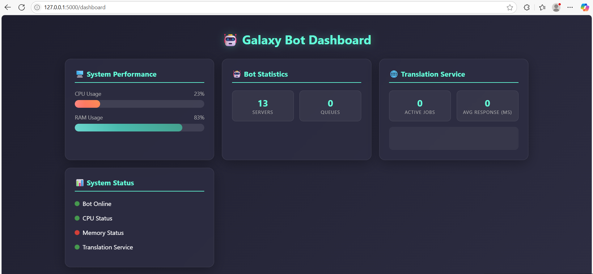
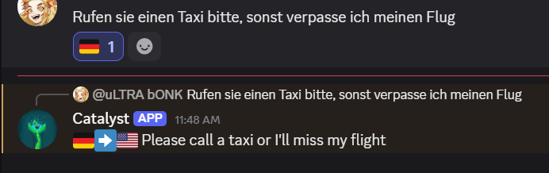

# Scalable Translation Microservice

A high-performance Discord bot that demonstrates distributed systems architecture and real-time resource management using Python multiprocessing.

### The Problem
I set out to challenge myself by doing something I hadn't done before. I wanted to make a translation software that utilized AI, but I wanted to design it so it could run on severely resource constrained hardware. I had a loose idea in my head of making something that could integrate with LoRa technology, or mesh networks, so people in places in the world that don't have cell service could translate with cost efficiency.

Built over an intense 48-hour development sprint, there were several features I didn't implement, but would love to if I had the time. Multiple-language support. I also didn't handle security, such as rate limiting so the bot couldn't be easily flooded with too many requests. I sacrificed those because this was meant to be an easily-portable back end for a variety of services, with a focus on the processing architecture.

As of right now, this product will run efficiently on raspberry pi devices with 2+ GB of RAM and headless OS.

## Architecture Highlights

- **Distributed Worker System**: Spawns translation workers across multiple CPU cores with automatic load balancing
- **Real-time Monitoring**: Live CPU, RAM, and queue monitoring with web dashboard
- **Resource-Aware Scaling**: Automatically creates/destroys workers based on system load and demand
- **Process Isolation**: Each translation task runs in isolated processes for stability and performance
- **Inter-Process Communication**: Uses multiprocessing pipes for efficient task distribution

## Technical Features

- CPU core affinity for optimal performance
- Adaptive queue management with overflow protection
- Comprehensive error handling and logging
- RESTful monitoring API with JSON endpoints
- Async/await patterns for concurrent operations
- Flask web interface for real-time system metrics

## Dashboard Example


## Translation Example


## Use Case
Currently optimized for German-to-English translation via Discord reactions, but the architecture easily extends to any CPU-intensive task requiring distributed processing.

## Setup

### Prerequisites
- Python 3.12 - (Required - argostranslate compatibility)
- Discord Bot Token

### Installation

1. Clone the repository:
```bash
git clone https://github.com/galaxyholly/scalable-translation-microservice.git
cd scalable-translation-microservice
```

2. Install Dependencies:
```bash
pip install -r requirements.txt
```

3. Create environment file
```bash
cp .env.example .env
```

4. Edit .env with your actual token.

5. Run the bot.
```bash
python galaxybot.py
```

## Usage

React to any message with 🇩🇪 to translate it from German to English. 

**Live Monitoring**: While the bot is running, visit http://127.0.0.1:5000/dashboard to view real-time system metrics and performance data.
